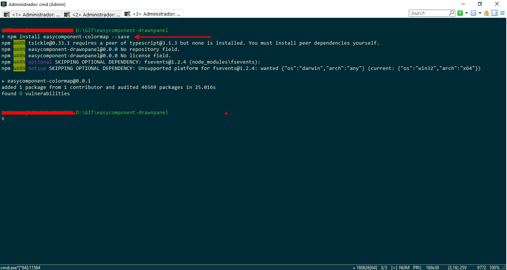
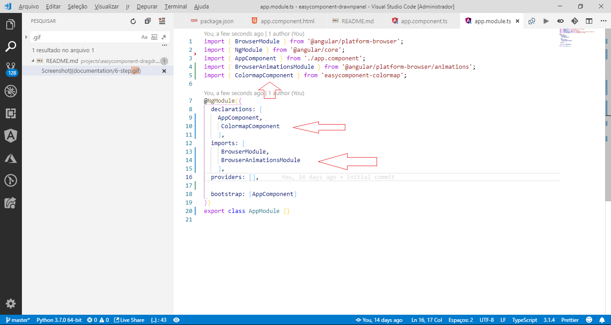
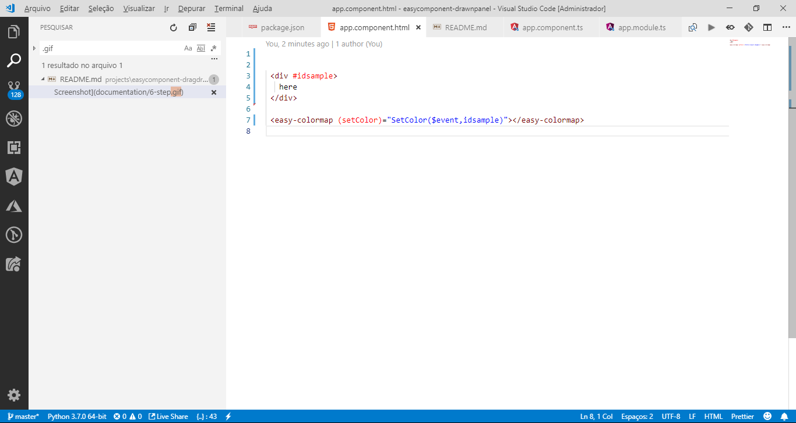
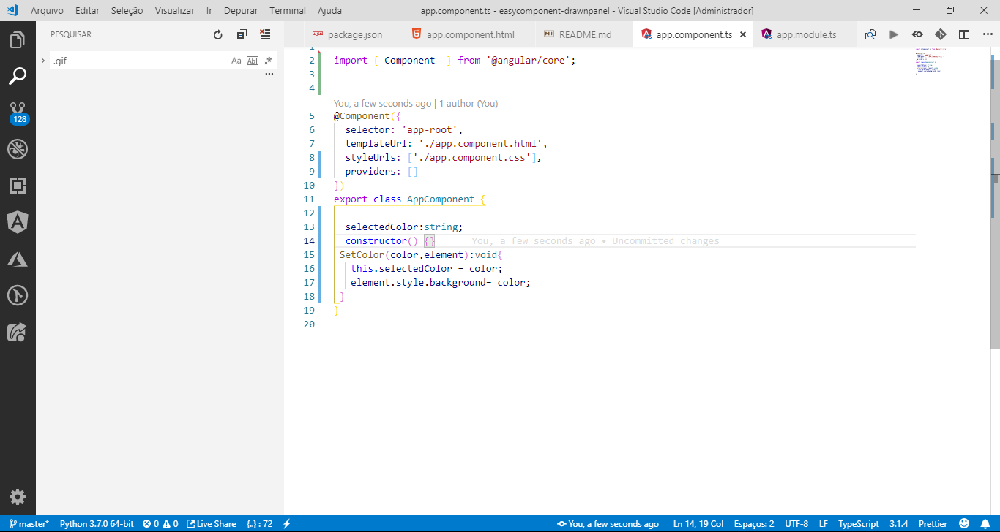

"# easycomponent-colormap" 

1- npm install easycomponent --save

2- In the module you hava to add , ColormapComponent and BorowserAnimationsModule

3- in the html file just use easy component colormap 

4- Implemente a method to receive an event from easy component colormap

5- VOILA !!

| Output                        | Input         |  
| -------------                 |:-------------:|  
| (setColor)="method($event)     |  NONE         |  
|                               |               |  
|                               |               |  

Do. Or do not. There is no try.
